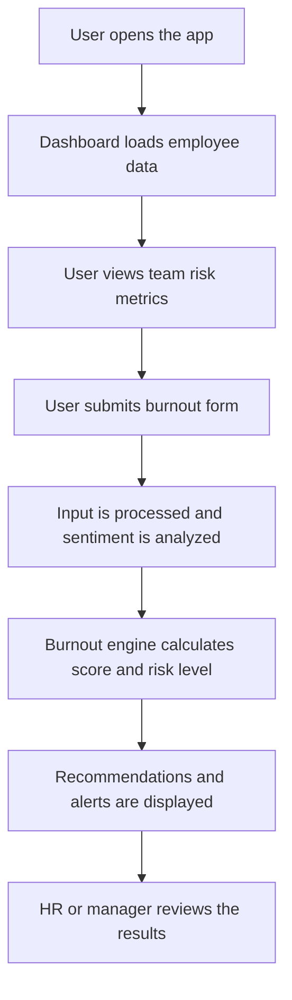
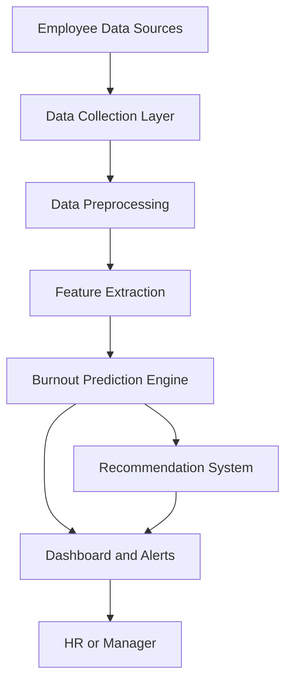
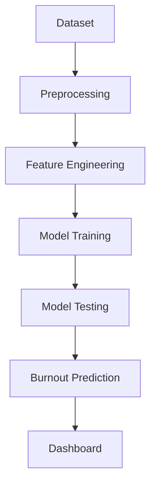
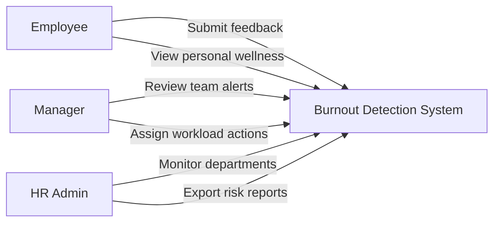
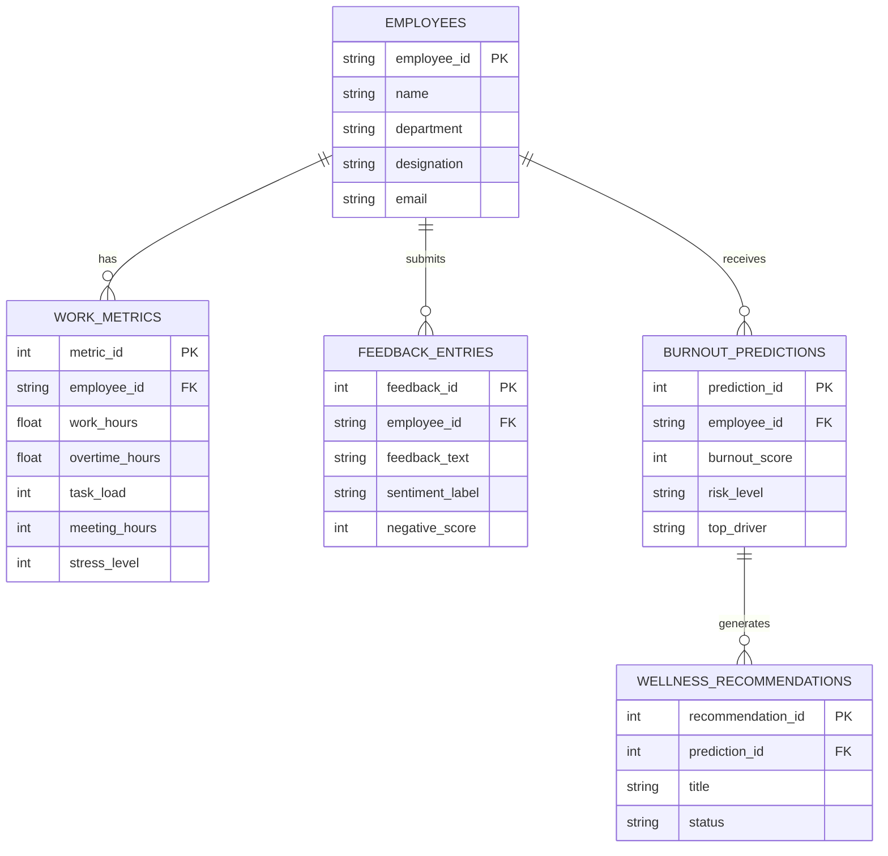

# UML Diagrams

## Project Flow Chart

```mermaid
flowchart TD
  A["User opens the app"] --> B["Dashboard loads employee data"]
  B --> C["User views team risk metrics"]
  C --> D["User submits burnout form"]
  D --> E["Input is processed and sentiment is analyzed"]
  E --> F["Burnout engine calculates score and risk level"]
  F --> G["Recommendations and alerts are displayed"]
  G --> H["HR or manager reviews the results"]
```

## System Architecture

```mermaid
flowchart TD
  A["Employee Data Sources"] --> B["Data Collection Layer"]
  B --> C["Data Preprocessing"]
  C --> D["Feature Extraction"]
  D --> E["Burnout Prediction Engine"]
  E --> F["Dashboard and Alerts"]
  F --> G["HR or Manager"]
  E --> H["Recommendation System"]
  H --> F
```

## Machine Learning Workflow

```mermaid
flowchart TD
  A["Dataset"] --> B["Preprocessing"]
  B --> C["Feature Engineering"]
  C --> D["Model Training"]
  D --> E["Model Testing"]
  E --> F["Burnout Prediction"]
  F --> G["Dashboard"]
```

## Use Case Diagram

```mermaid
flowchart LR
  Employee["Employee"]
  Manager["Manager"]
  HR["HR Admin"]
  System["Burnout Detection System"]

  Employee -->|"Submit feedback"| System
  Employee -->|"View personal wellness"| System
  Manager -->|"Review team alerts"| System
  Manager -->|"Assign workload actions"| System
  HR -->|"Monitor departments"| System
  HR -->|"Export risk reports"| System
```

## Entity Relationship Diagram

```mermaid
erDiagram
  EMPLOYEES ||--o{ WORK_METRICS : has
  EMPLOYEES ||--o{ FEEDBACK_ENTRIES : submits
  EMPLOYEES ||--o{ BURNOUT_PREDICTIONS : receives
  BURNOUT_PREDICTIONS ||--o{ WELLNESS_RECOMMENDATIONS : generates

  EMPLOYEES {
    string employee_id PK
    string name
    string department
    string designation
    string email
  }

  WORK_METRICS {
    int metric_id PK
    string employee_id FK
    float work_hours
    float overtime_hours
    int task_load
    int meeting_hours
    int stress_level
  }

  FEEDBACK_ENTRIES {
    int feedback_id PK
    string employee_id FK
    string feedback_text
    string sentiment_label
    int negative_score
  }

  BURNOUT_PREDICTIONS {
    int prediction_id PK
    string employee_id FK
    int burnout_score
    string risk_level
    string top_driver
  }

  WELLNESS_RECOMMENDATIONS {
    int recommendation_id PK
    int prediction_id FK
    string title
    string status
  }
```
